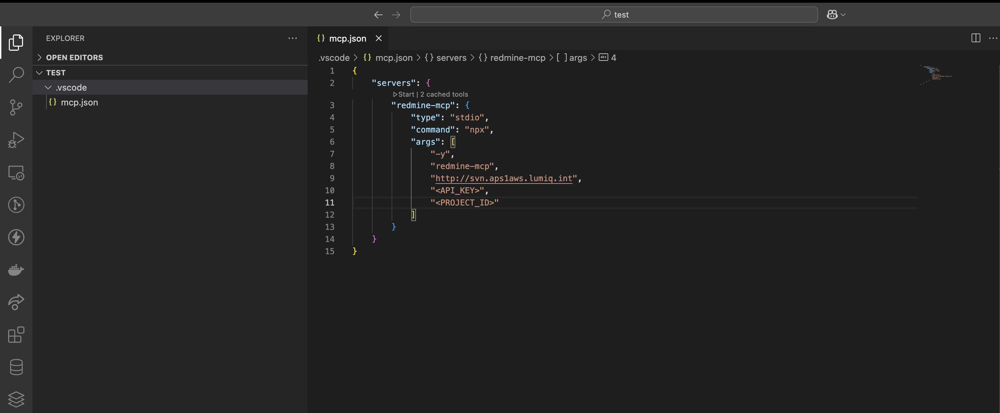

## Redmine MCP

Use this REDMINE MCP to log your time daily with summary all generated by AI Agent based on what work you have done.
You focus on your work, let your agent do the logging for you.


1. Go to your redmine [account page](https://svn.aps1aws.lumiq.int/my/account) and from the right side bar copy your **API access key**


2. Go to your project home page and from url copy the project id. e.g., empower-roadmap


3. Create a `.vscode/mcp.json` file in your project root with the following content:

```json
{
    "servers": {
        "redmine-mcp": {
            "type": "stdio",
            "command": "npx",
            "args": [
                "-y",
                "redmine-mcp",
                "http://svn.aps1aws.lumiq.int", // NOTE :- Don't use https here
                "<API_KEY>",
                "<PROJECT_ID>" // e.g., empower-roadmap
            ]
        }
    }
}
```

4. You can also set the mcp server globally, go to settings and search for MCP and configure this MCP server there, if you wish to use this accross the projects.

4. Start the mcp server using the start button above the mcp server name redmine-mcp. 


5. Now ask your agent to log your time for the day with the summary of what you have done in how much time.
example : 


No need to come up with the description of what you have done, how much time you worked on. All will be taken care by AI Agent now.